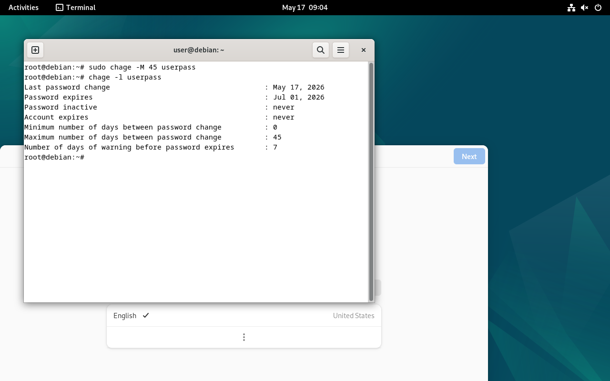
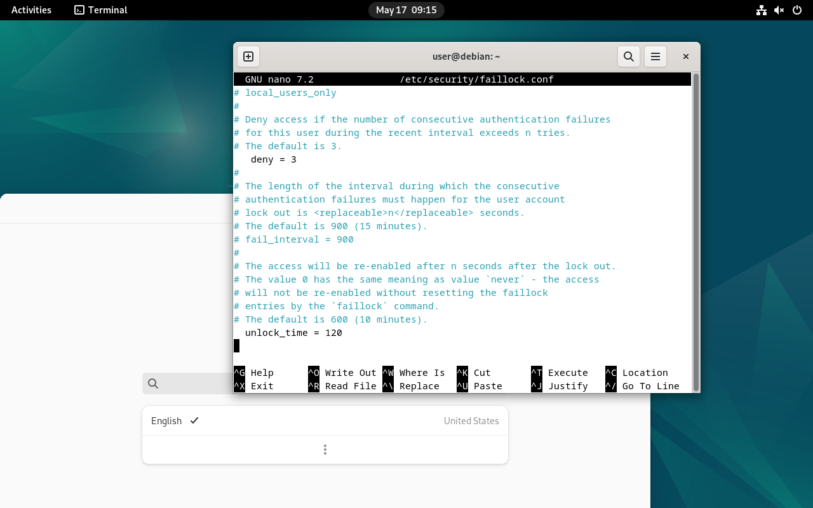
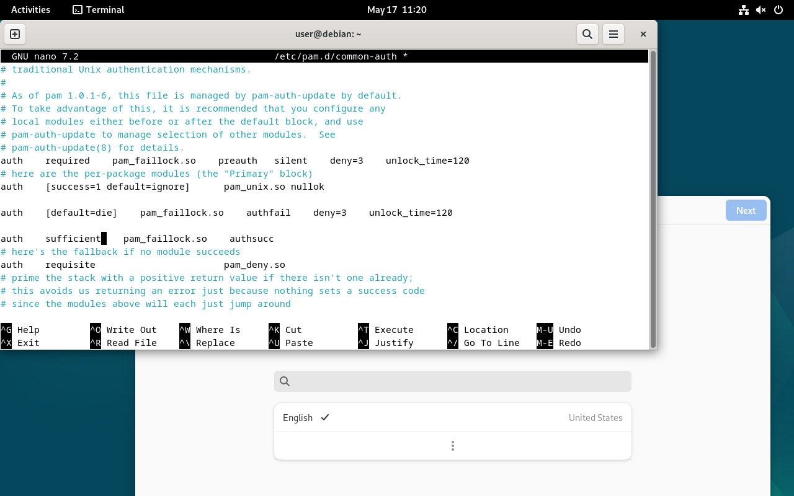
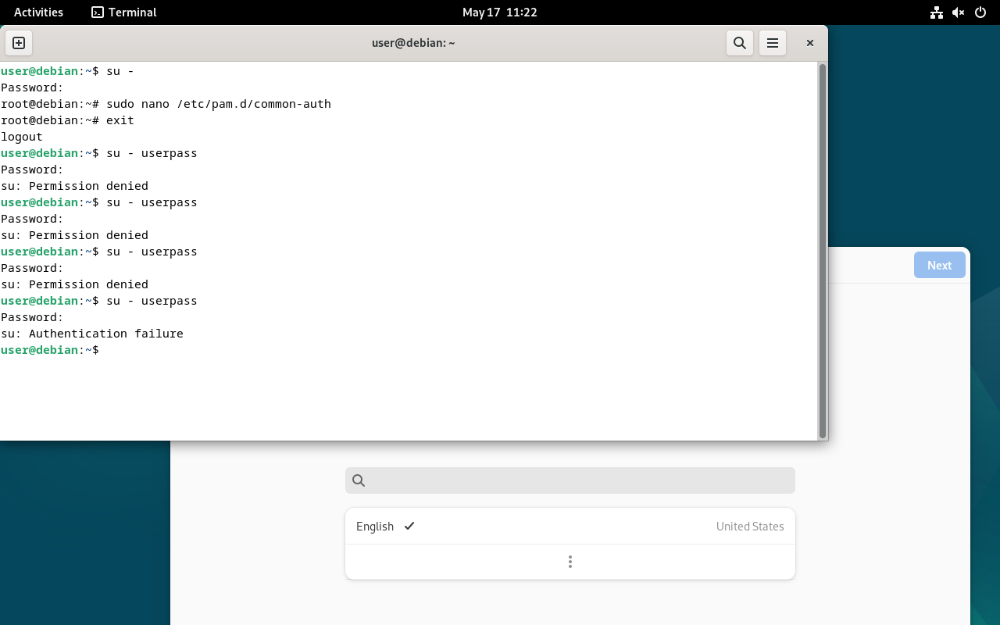
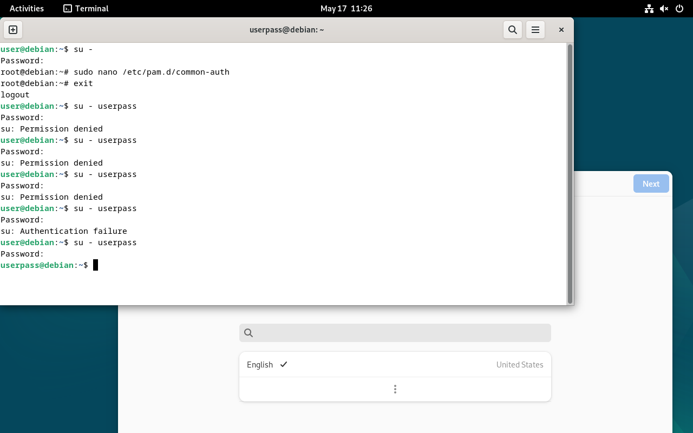

## 1. Настройка срока действия пароля

Для пользователя `userpass` был установлен максимальный срок действия пароля — **45 дней**.

Команда:

```bash
sudo chage -M 45 userpass
```

Проверка:

```bash
chage -l userpass
```

Скриншот результата:



---

## 2. Настройка faillock

Был открыт файл:

```bash
sudo nano /etc/security/faillock.conf
```

В него были добавлены параметры:

```ini
deny = 3
unlock_time = 120
```

Где:

- `deny = 3` — блокировка после трёх неверных попыток;
- `unlock_time = 120` — автоматическая разблокировка через 120 секунд.

Скриншот настройки:



---

## 3. Настройка PAM-аутентификации

Был изменён файл:

```bash
sudo nano /etc/pam.d/common-auth
```

В него были добавлены строки:

```text
auth required pam_faillock.so preauth silent deny=3 unlock_time=120
auth [default=die] pam_faillock.so authfail deny=3 unlock_time=120
auth sufficient pam_faillock.so authsucc
```

Скриншот:



---

## 4. Проверка блокировки учётной записи

После нескольких неверных попыток входа система начала отклонять авторизацию:

```text
su: Permission denied
su: Authentication failure
```

Скриншот проверки:



---

## 5. Проверка успешного входа после разблокировки

После ожидания времени блокировки был выполнен успешный вход под пользователем `userpass`.

Скриншот:



---

# Итог

Настройка выполнена успешно:

| Требование | Статус |
|---|---|
| Срок действия пароля — 45 дней | Выполнено |
| Блокировка после 3 неверных попыток | Выполнено |
| Время блокировки — 2 минуты | Выполнено |
| Повторный вход после разблокировки работает | Выполнено |

---

## Использованные команды

```bash
sudo chage -M 45 userpass
chage -l userpass

sudo nano /etc/security/faillock.conf
sudo nano /etc/pam.d/common-auth

su - userpass
```
