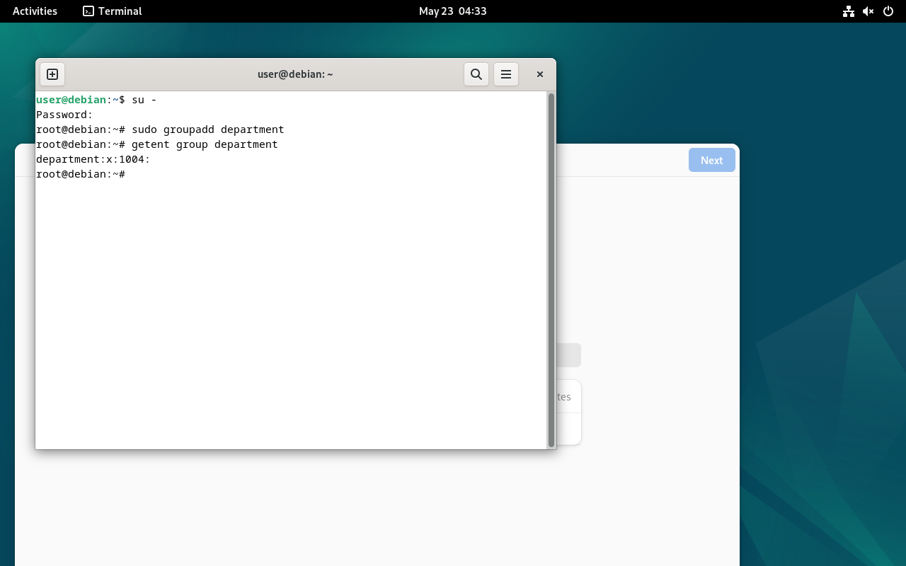
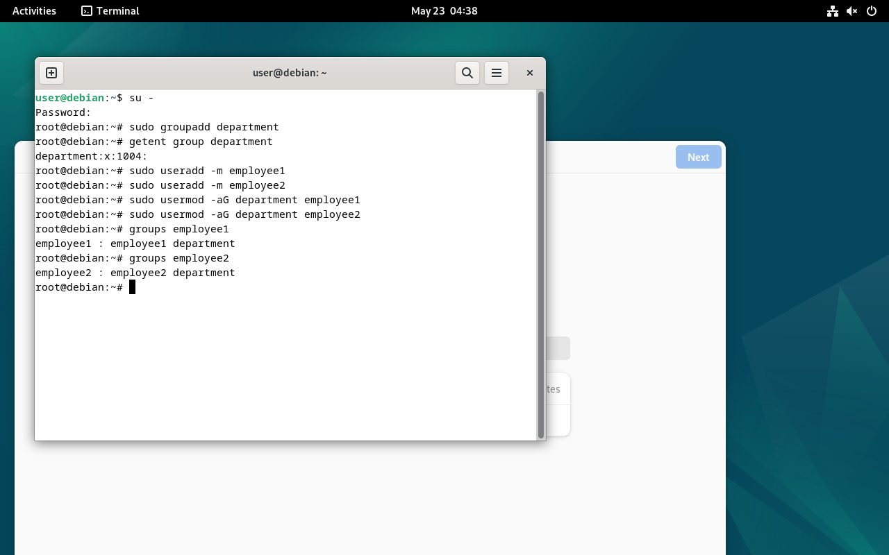

# 1. Создание группы отдела

Создание группы `department`.

```bash
sudo groupadd department
getent group department
```

Результат:

```text
department:x:1004:
```

Скриншот:



---

# 2. Создание пользователей и добавление в группу

Создание пользователей:

```bash
sudo useradd -m employee1
sudo useradd -m employee2
```

Добавление пользователей в группу:

```bash
sudo usermod -aG department employee1
sudo usermod -aG department employee2
```

Проверка:

```bash
groups employee1
groups employee2
```

Результат:

```text
employee1 : employee1 department
employee2 : employee2 department
```

Скриншот:



---

# 3. Создание общей директории

Создание директории:

```bash
sudo mkdir /shared_department
```

Проверка директории:

```bash
ls -ld /shared_department
```

Скриншот:


---

# 4. Настройка прав доступа

Назначение группы директории:

```bash
sudo chown :department /shared_department
```

Настройка прав:

```bash
sudo chmod 2770 /shared_department
```

Описание прав:

| Параметр | Значение |
|---|---|
| 2 | SetGID-бит |
| 770 | Полный доступ владельцу и группе |
| others | Нет доступа |

Скриншот:


---

# 5. Проверка доступа employee1

Вход под пользователем `employee1`:

```bash
su - employee1
```

Переход в директорию и создание файла:

```bash
cd /shared_department
touch /shared_department/somefile.txt
ls -la
```

Результат:

```text
-rw-r--r-- 1 employee1 department 0 May 23 04:59 somefile.txt
```

Это подтверждает:

- `employee1` имеет доступ;
- может создавать файлы;
- файл автоматически наследует группу `department`.

Скриншот:

.png)

---

# 6. Проверка ограничения доступа

Вход под пользователем `outsider`:

```bash
su - outsider
```

Попытка входа в директорию:

```bash
cd /shared_department
```

Результат:

```text
-sh: 2: cd: can't cd to /shared_department
```

Это подтверждает отсутствие доступа.

Скриншот:

.png)
