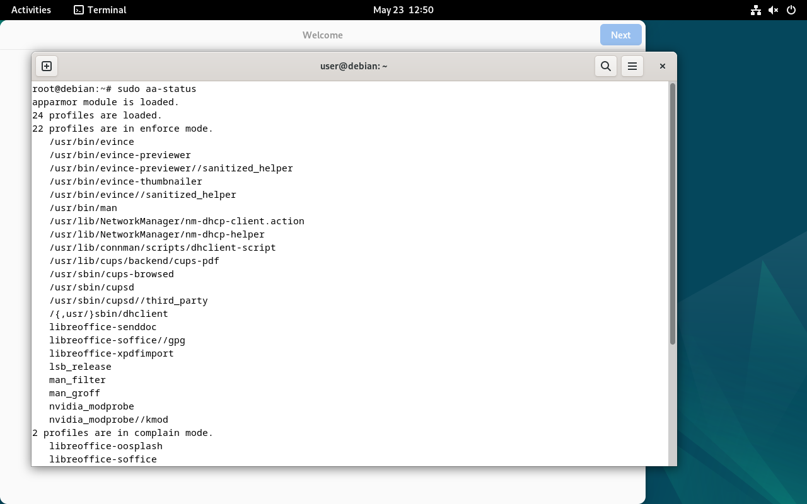
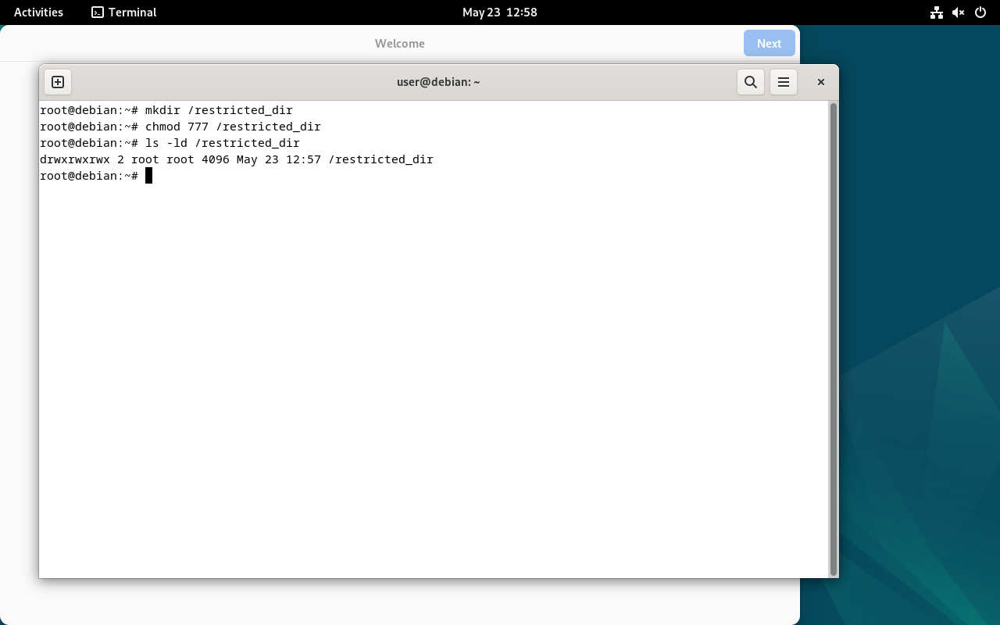
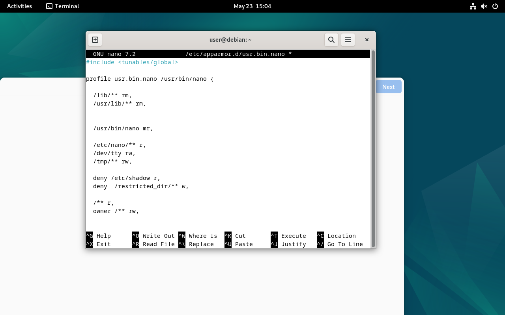
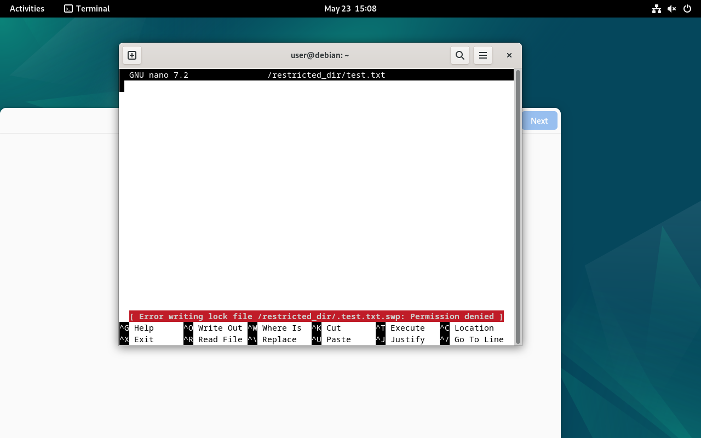
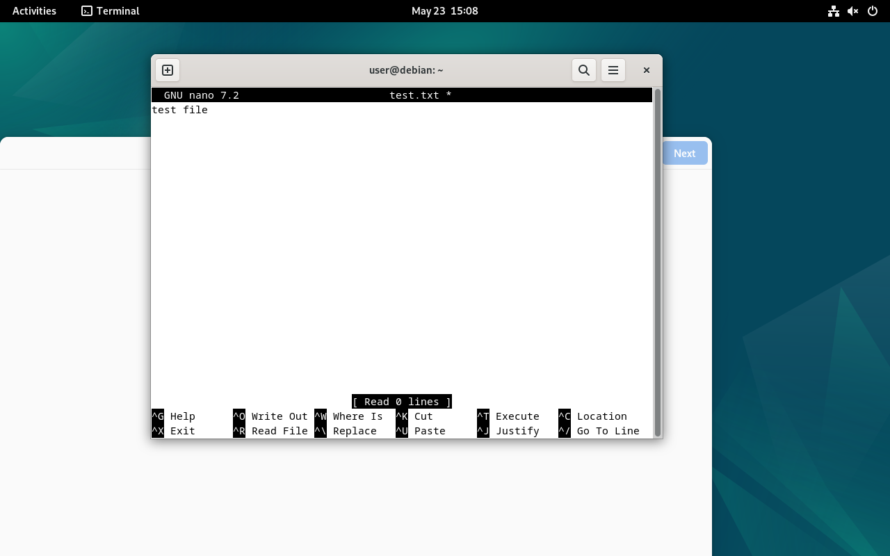

## 1. Проверка статуса AppArmor

Проверили, что AppArmor запущен и профили активны:

```bash
sudo aa-status
```

Скриншот:



---

## 2. Создание директории с ограничением

Создали директорию `/restricted_dir`, в которую позже будет запрещена запись через профиль AppArmor.

Команды:

```bash
mkdir /restricted_dir
chmod 777 /restricted_dir
ls -ld /restricted_dir
```

Скриншот:



---

## 3. Создание профиля AppArmor для nano

Создали и настроили профиль `/etc/apparmor.d/usr.bin.nano`.

В профиль были добавлены правила:

```text
deny /etc/shadow r,
deny /restricted_dir/** w,
```

Это запрещает:

- чтение файла `/etc/shadow`
- запись файлов внутри `/restricted_dir`

При этом обычная работа редактора nano сохраняется.

Скриншот профиля:



---

## 4. Проверка ограничения записи

Попытались создать файл:

```bash
nano /restricted_dir/test.txt
```

AppArmor заблокировал запись.

На экране появилась ошибка:

```text
Permission denied
```

Скриншот:



---

## 5. Проверка обычной работы nano

Проверили, что nano продолжает нормально работать вне запрещённой директории.

Создали обычный файл:

```bash
nano test.txt
```

Файл успешно открылся и редактировался.

Скриншот:



---
- запретить приложению nano читать `/etc/shadow`
- запретить запись в `/restricted_dir`
- сохранить остальной функционал nano

Профиль AppArmor работает корректно.
